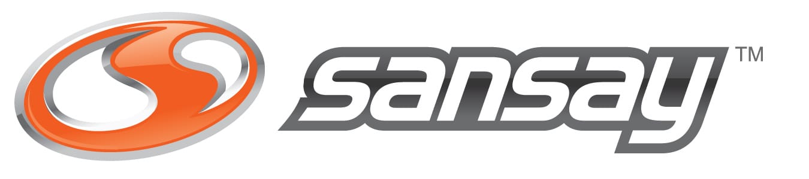

# Sansay SHAKEN Cert Vending Machine

A static marketing/demo website for **Sansay** that simulates a vending machine UI where users can "purchase" STIR/SHAKEN certifications. Built for GitHub Pages.



## What It Does

The site has two pages:

### Home (`index.html`) — The Vending Machine
- A full interactive vending machine with 12 STIR/SHAKEN certification products (slots A1–D3, priced $450–$1,000)
- **Glass display** with items arranged on metal shelves behind a reflective glass panel
- **Control panel** with LED display, round keypad buttons, bill slot with green LED indicator, coin return, and lock detail
- **Dispense animation** — selecting an item triggers a glow → shake → fall animation where the cert drops from its shelf into the pickup tray
- **Sound effects** via Web Audio API (beep, clunk, error, success) — no audio files needed
- **Keyboard shortcuts** — type A–D + 1–3 to select slots, Enter to vend, Escape to clear
- Clicking the dispensed cert in the pickup tray navigates to checkout

### Checkout (`checkout.html`) — Mock Payment
- Shows order summary (item name, slot, price) passed via URL query parameters
- Mock credit card form with card number formatting (groups of 4) and expiry formatting (MM/YY)
- "Pay" button shows a success confirmation with animated checkmark
- Back link returns to the vending machine

## Tech Stack

- **HTML/CSS/JS** — no build step, no frameworks, fully static
- **[GSAP 3.12.5](https://greensock.com/gsap/)** — timeline-based animations (dispense sequence, UI transitions)
- **[Google Fonts](https://fonts.google.com/)** — Orbitron (display), Inter (body), JetBrains Mono (monospace/LED)
- **Web Audio API** — procedural sound effects using oscillators
- **CSS** — glass reflections (diagonal gradient overlays), brushed metal textures, chrome trim effects, responsive grid/flex layouts

## Design Details

The machine is designed to look like a physical vending machine:

- **Brushed metal body** with chrome trim border and corner screws
- **Glass panel** with diagonal reflection overlay and shine streak
- **Chrome frame** around the glass (5px border)
- **Interior fluorescent lighting** simulation via top gradient
- **Metal shelf dividers** between rows with metallic gradients
- **Control panel** with recessed look, round buttons (not rectangular), bill slot with pulsing green LED, coin return with label, and lock detail
- **Ventilation grille** at the bottom of the machine
- **Warm lobby background** (#d6d2cc) — like a showroom floor

## Responsive Design

- **Desktop (1024px+)**: Side-by-side layout — control panel on the left, glass display on the right
- **Tablet/Mobile (≤768px)**: Stacked layout — glass display on top, control panel below with a two-column CSS grid (bill slot → LED → coin return on the left, keypad on the right)
- **Small Mobile (≤420px)**: Tighter spacing, smaller buttons and cards
- **Touch devices**: Tap-friendly with `:active` states instead of `:hover`

## Running Locally

No build step required. Just serve the files with any static server:

```bash
# Python
python3 -m http.server 8080

# Node
npx serve .

# Or just open index.html in a browser
```

## File Structure

```
├── index.html          # Vending machine homepage
├── checkout.html       # Mock checkout/payment page
├── css/
│   └── styles.css      # All styles (1028 lines)
├── js/
│   ├── vending.js      # Vending machine logic, items, animations, sounds
│   └── checkout.js     # Checkout form handling, mock payment
└── assets/
    └── sansay-logo.jpg # Sansay company logo
```

## Certification Products

| Slot | Name | Price |
|------|------|-------|
| A1 | Basic Attestation | $500 |
| A2 | Compliance Score+ | $550 |
| A3 | Cross-Net Token | $800 |
| B1 | SBC Gateway Cert | $500 |
| B2 | Advanced STI-VS | $800 |
| B3 | Master SHAKEN | $900 |
| C1 | Robocall Shield | $500 |
| C2 | Carrier Gateway Pro | $900 |
| C3 | Enterprise Bundle | $1,000 |
| D1 | Custom Attestation | $600 |
| D2 | Network Auditor | $750 |
| D3 | Vault Reset | $450 |

## Deployment

Push to a GitHub Pages-enabled repository and the site is live — no build step, no dependencies to install.
